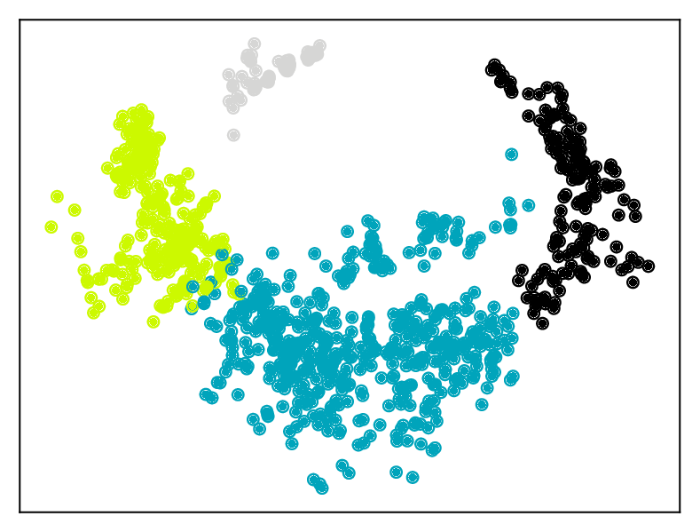
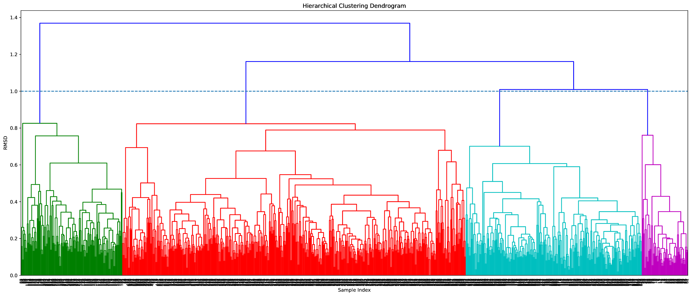

# Clustering Trajectory
This Python script receives a molecular dynamics or Monte Carlo trajectory (in .pdb, .xyz or any format supported by OpenBabel), finds the minimum RMSD between the structures with the Kabsch algorithm and performs agglomerative clustering (a kind of unsupervised machine learning) to classify similar conformations. 
The script was developed with Python 3 in mind, however, it should work in Python 2.7 too, given that all the libraries are available.

What the script does is to calculate the distance (using the minimum RMSD) between each configuration of the trajectory, building a distance matrix (stored in the condensed form).
Notice that calculating the distance matrix might take some time depending on how long your trajectories are and how many atoms there are in each configuration.
The distance matrix can also be read from a file (with the `-i` option) to avoid recalculating it every time you want to change the linkage method (with`-m`) or distance of the clustering.

## Dependencies
The implementation rely on several libraries, so before running the script, make sure you have all of them installed in your Python distribution.
Currently, the following libraries are required:
- [argparse](https://docs.python.org/3/library/argparse.html)
- [NumPy](http://www.numpy.org/)
- [OpenBabel](http://openbabel.org/)
- [RMSD](https://github.com/charnley/rmsd)
- [SciPy](https://www.scipy.org/)
- [scikit-learn](http://scikit-learn.org/stable/index.html)
- [matplotlib](https://matplotlib.org/)

We recommend the use of the [Anaconda](https://www.anaconda.com/download/) Python distribution.
To install the libraries with Anaconda, do the following:
```
conda install numpy
conda install -c openbabel openbabel
conda install scipy
conda install scikit-learn
conda install matplotlib
conda install pip
pip install rmsd
```

In this case, be sure you install OpenBabel via conda, and not through `pip`, since the `pip` version have some strange behavior as reported [here](https://github.com/scikit-learn/scikit-learn/issues/10196) and confirmed [here](https://github.com/openbabel/openbabel/issues/1702).

If you don't want to use Anaconda, you can install most of those libraries using your package manager or with pip:
```
pip install argparse
pip install numpy
pip install openbabel
pip install rmsd
pip install scipy
pip install scikit-learn
pip install matplotlib
```

## Usage
To see all the options run the script with the `-h` command option:
```
python clustering_traj.py -h
```

The only mandatory arguments are the path to the file containing the trajectory (in a format that OpenBabel can read with Pybel) and the maximum RMSD between two configurations for them to be considered of the same cluster.
```
python clustering_traj.py trajectory.xyz 1.0
```

Additional options are available for specifying the input and output files and selecting how the clustering is done.
The possible methods used for the agglomerative clustering are the ones available in the linkage method of SciPy's hierarchical clustering.
A list with the possible methods (selected with `-m`) and the description of each of them can be found [here](https://docs.scipy.org/doc/scipy-0.19.1/reference/generated/scipy.cluster.hierarchy.linkage.html).
The default method for the linkage is `average`, since [it was found](https://dx.doi.org/10.1021/ct700119m) to have a good compromise with the number of clusters and the actual similarity.
To learn more about how the clustering is performed using this algorithm, see [UPGMA](https://en.wikipedia.org/wiki/UPGMA).

If the `-n` option is used, the hydrogens are ignored when performing the Kabsch algorithm to find the superposition and calculating the RMSD.
This is useful to avoid clustering identical structures with just a methyl group rotated as different.

To use an already saved distance matrix, specify the file containing the distance matrix in the condensed form with the `-i` option.
The options `-i` and `-od` are mutually exclusive.

The `-p` flag specifies that pdf plots of some information will be saved.
In this case, the filenames will start with the same name used for the clusters output (specified with the `-oc` option).
When the option is used, the following is saved to disk:
- A plot with the [multidimensional scaling](http://scikit-learn.org/stable/modules/manifold.html#multidimensional-scaling) representation of the distance matrix, colored with the clustering information
- The [dendrogram](https://en.wikipedia.org/wiki/Dendrogram)
- The cluster classification evolution, that shows how during the trajectory, the configurations were classificated. This might be useful to analyze the quality of your sampling.

If the `-cc` option is specified (along with a format supported by OpenBabel) the configurations belonging to the same cluster are superposed and printed to a file.
The superpositions are done considering the [medoid](https://en.wikipedia.org/wiki/Medoid) of the cluster as reference.
The medoid is printed as the first structure in the clustered strcuture files.
If you did not consider the hydrogens while building the distance matrix, remember to use the `-n` option even if with `-i` in this case, since the superposition is done considering the flag.

The `-np` option specified the number of processes to be used to calculate the distance matrix.
Since this is the most time consuming task of the clustering, and due to being a embarassingly parallel problem, it was parallelized using a Python [multiprocessing pool](https://docs.python.org/3/library/multiprocessing.html).
The default value for `-np` is 4.

## Output
Some basic information about the size clusters are printed to `STDOUT`.
The number of clusters that were found, as well as the number of members for each cluster are printed in a table.
Below there is an example of how this information is printed:
```
$ python /path/to/clustering_traj.py solute_confs.xyz 1.0 -np 6 -n -p -cc xyz

Calculating distance matrix

Saving condensed distance matrix to distmat.dat

Starting clustering using 'average' method to join the clusters

Saving clustering classification to clusters.dat

Writing superposed configurations per cluster to files clusters_confs_*.xyz

A total of 4 cluster(s) was(were) found.

A total of 1000 structures were read from the trajectory. The cluster sizes are:
Cluster	Size
1	152
2	515
3	264
4	69

```

In the cluster output file (`-oc` option, default filename `clusters.dat`) the classification for each structure in the trajectory is printed.
For example, if the first structure of the trajectory belongs to the cluster number *2*, the second structure belongs to cluster *1*, the third to cluster *2* and so on, the file `clusters.dat` will start with
```
2
1
2
.
.
.
```

The plot of the multidimensional representation (when the `-p` option is used) have each cluster colored in one color as the following picture:


The dendrogram has an horizontal line plotted with it indicating the cutoff used for defining the clusters:


The evolution of the classification with the trajectory looks like:


If you wish to use the distance matrix file to other uses, bear in mind that the matrix is stored in the condensed form, i.e., only the superior diagonal matrix is printed (not including the diagonal).
It means that if you have `N` structures in your trajectory, your file (specified with `-od` option, default filename `distmat.dat`) will have `N(N-1)/2` lines, with each line representing a distance.

